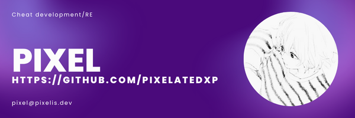

# Hi, I'm Pixel 👋

### I build C++ tools, python scripts, and game cheats.

---

  

  

---

### Projects
- **Working on**: [Pixel's CS2 Internal](https://github.com/pixelatedxp/Pixel-CS2-Internal) - A cheat for CS2.
- **Learning**: Game security, Reverse engineering, and C++.
- **Website**: My tools are at [pixelis.dev](https://pixelis.dev)

---

### Tech Stack & Tools 💻

**Languages**

  
  
  

**Tools**

  
  
  

---

### Contact
- **Ask me about**: C++, Game Cheats, and UI.
- **Email**: [pixel@pixelis.dev](mailto:pixel@pixelis.dev)
- **YouTube**: [pixelatedxpert](https://www.youtube.com/@PixelatedXpert)
- **Fun fact**: I think I'm funny (People disagree).
